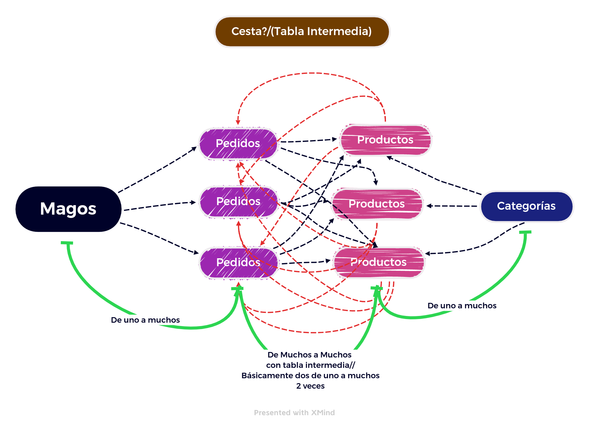
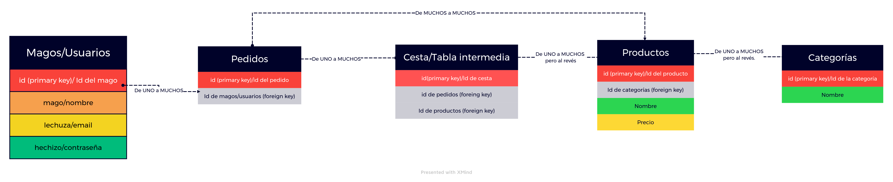

# REST API with Express and Sequelize for Ecommerce.

# [User requests documentation](https://documenter.getpostman.com/view/21016555/Uz5ArJFh)

# [Product Categories requests documentation](https://documenter.getpostman.com/view/21016555/Uz5ArJFk)


# [Order requests documentation](https://documenter.getpostman.com/view/21016555/Uz5ArJFo)

# [Products requests documentation](https://documenter.getpostman.com/view/21016555/Uz5ArJFp#1b5dcc4d-4fd5-4080-be2b-0d5e04b68839)

Hi everyone! [Imanol](https://github.com/Imi21) and [Gabo](https://github.com/gabriel19971029) just developed our first API. Feel free tu test it out.

## Getting Started

Well, just visit the documentation links and enjoy! 

### You want to own this website?

On the other hand if you'd like to host this website on your local machine just clone this repository with ```git clone https://github.com/gabriel19971029/ProyectoBackEndTheBridge.git```. just copy and paste that command on your terminal and start a local server. That's it.

## Deployment

This website it's been deployed and made available to the public thanks to Github Pages, which is a completely free hosting for single page applications.

## Built With

* [JavaScript](https://www.javascript.com/)
* [Express](https://express.com/)
* [MySQL](https://mysql.com/) 
* [Sequelize](https://www.sequelize.info/) 

## Database structure




## Contributing

  Like, share, subscribe, follow and join our Patreon! Just kidding this is totally for free. 

## Authors

* **Imanol** - [Imanol](https://github.com/Imi21)
* **Gabriel Clemente, aka Gabo** - [Gabo](https://github.com/gabriel19971029)

## License

This project is licensed under the Creative Commons Public Domain License - Feel free to copy the code, We did it too.


## Acknowledgments

* Thanks to Juan for making such cool youtube tutorials.
